

# 🫁 LungCare

### Smart Management System for Obstructive Lung Disease

**Integrated Smart Inhaler · Smart Spirometer · Mobile Application · Cloud Monitoring**

 

 

> **Breathe Smarter, Live Better**

---

## 📌 Repository Scope

This repository is a **public showcase version** of the LungCare graduation project.

The complete source code is kept private for security reasons because the full system integrates with Firebase services, Bluetooth Low Energy communication, ESP32 firmware, smart-device actuation logic, and patient-related medical workflows.

This public repository presents:

- Project idea and motivation
- System architecture
- Smart device concept
- Mobile application features
- Patient and doctor workflows
- User interface screenshots
- Academic project information

---

## 📖 Table of Contents

- [Project Overview](#-project-overview)
- [Problem Statement](#-problem-statement)
- [LungCare Solution](#-lungcare-solution)
- [LungCare Smart Device](#-lungcare-smart-device)
- [Product Architecture](#-product-architecture)
- [Smart Inhaler Module](#-smart-inhaler-module)
- [Smart Spirometer Module](#-smart-spirometer-module)
- [Mobile Application](#-mobile-application)
- [Application Workflows](#-application-workflows)
- [Screenshots](#-screenshots)
- [Technology Stack](#-technology-stack)
- [Security Note](#-security-note)
- [Academic Information](#-academic-information)
- [Disclaimer](#-disclaimer)

---

## 🫁 Project Overview

**LungCare** is a smart connected respiratory-care system designed to support patients with obstructive lung diseases.

The system combines a custom smart respiratory device, a Flutter mobile application, Bluetooth Low Energy communication, and Firebase cloud services to provide medication support, guided spirometry testing, medical reporting, and remote doctor follow-up.

LungCare is designed as a complete patient-doctor-device ecosystem that connects:

- A smart inhaler module for safer medication delivery
- A smart spirometer module for guided lung-function testing
- A mobile application for patients and doctors
- Firebase cloud services for medical data storage and monitoring

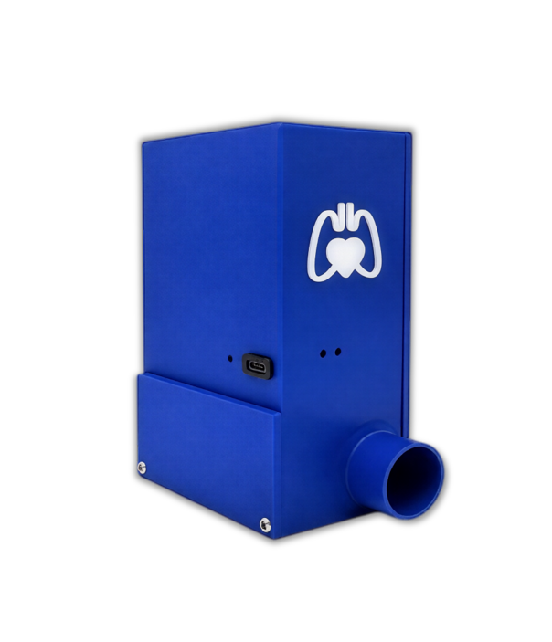

---

## 🚩 Problem Statement

Patients with obstructive lung diseases often require continuous care, correct medication use, and regular lung-function monitoring.

Traditional respiratory care is still separated into disconnected steps:

- Manual inhaler use
- Clinic-based spirometry
- Manual medication tracking
- Delayed doctor follow-up
- Limited objective home-monitoring data

This creates challenges for both patients and doctors.

| Patient Challenges | Doctor Challenges |
|---|---|
| Incorrect inhaler technique | Limited objective follow-up data |
| Poor hand-breath coordination | Unclear adherence history |
| Difficulty confirming correct dose delivery | Delayed clinical intervention |
| No simple home-based lung-function test | Difficulty monitoring progress remotely |
| Poor medication tracking | Limited remote visibility |

---

## ✅ LungCare Solution

LungCare transforms respiratory care from manual and disconnected into **smart, guided, and connected care**.

The system supports:

- Automated medication actuation
- Guided spirometry testing
- Digital medication tracking
- Lung-function result visualization
- Remote doctor review
- Patient notifications and reminders
- Secure device ownership and pairing

---

## 🔧 LungCare Smart Device

LungCare is not only a mobile application. It is designed as a complete smart respiratory-care device connected to a mobile platform.

The device integrates two main modules:

- **Smart Inhaler Module**
- **Smart Spirometer Module**

Together, these modules support medication delivery, lung-function testing, digital tracking, and doctor review through one connected system.

---

## 🏗️ Product Architecture

The system architecture connects embedded hardware, Bluetooth Low Energy communication, the Flutter mobile application, Firebase services, and clinical follow-up tools.

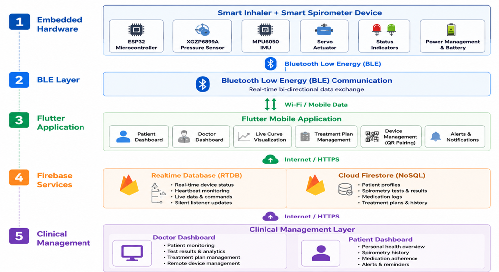

### Main Architecture Layers

| Layer | Description |
|---|---|
| Embedded Hardware | ESP32, sensors, servo actuator, indicators, and battery system |
| BLE Communication | Real-time bidirectional communication between the device and the mobile app |
| Flutter Mobile App | Patient dashboard, doctor dashboard, reports, alerts, and device management |
| Firebase Services | Authentication, Firestore records, Realtime Database device state |
| Clinical Management | Doctor review, patient monitoring, and treatment plan updates |

---

## 🧩 Product Design Concept

The LungCare device housing was custom-engineered to integrate the mechanical and electronic components required for portable respiratory care.

The design supports:

- pMDI canister placement
- Mouthpiece interface
- Spirometry airflow path
- Internal electronics placement
- Battery placement
- Servo motor alignment
- Overall mechanical integration

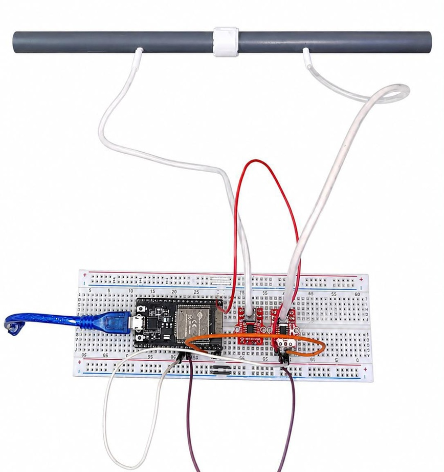

---

## 🖨️ 3D-Printed Housing

The physical prototype was built using a custom 3D-printed housing.

The housing was designed to support:

- Portable device form
- Stable inhaler positioning
- Integrated airflow path
- Internal electronics housing
- Mechanical actuation alignment

---

## 💊 Smart Inhaler Module

The Smart Inhaler module replaces manual inhaler pressing with a controlled and sensor-validated medication delivery mechanism.

### Key Capabilities

- Safety validation before actuation
- Correct orientation checking
- Inhalation-based triggering
- Servo-based canister pressing
- Confirmed dose logging to the mobile application
- Digital medication history for doctor review

The goal of this module is to improve dose delivery reliability, reduce incorrect inhaler technique, and support better treatment adherence.

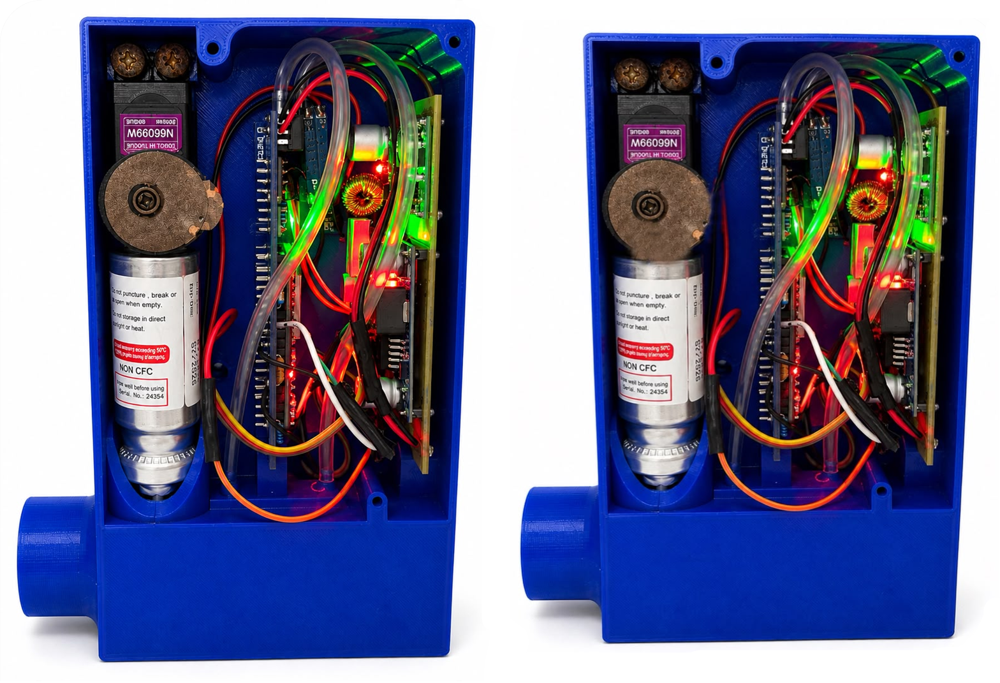

---

## 📈 Smart Spirometer Module

The LungCare Smart Spirometer brings lung-function assessment closer to the patient’s home.

### Key Capabilities

- Home-based assessment
- Guided test workflow
- Flow and volume calculation
- Spirometry report generation
- Doctor review through the mobile application

The spirometer relies on pressure-based airflow sensing to estimate airflow and calculate respiratory values such as:

- FVC
- FEV1
- FEV1/FVC ratio
- PEF
- FET

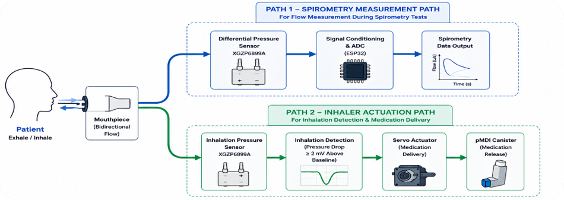

---

## 📱 Mobile Application

The LungCare mobile application connects the patient, doctor, smart device, and cloud services in one digital platform.

### Main App Modules

| Module | Purpose |
|---|---|
| Patient Dashboard | Gives the patient access to inhaler, spirometry, device status, and instructions |
| Doctor Dashboard | Allows doctors to monitor linked patients and review medical data |
| Smart Inhaler Card | Starts and tracks the medication dose workflow |
| Spirometry Card | Starts guided pulmonary function testing |
| My Device Page | Displays device status, battery level, connection state, and unpair option |
| Reports | Displays spirometry values, curves, and test quality notes |
| Notifications | Alerts the patient about treatment updates, low dose count, and low battery |

---

## 👤 Patient Experience

The patient can:

- Pair and manage a LungCare device
- Take medication using the smart inhaler workflow
- Perform guided spirometry tests
- View spirometry reports
- Receive treatment plan updates
- Receive low-dose and low-battery notifications
- Monitor device status through the My Device page

---

## 🩺 Doctor Experience

The doctor can:

- View linked patients
- Review patient profiles
- Monitor medication logs
- Review spirometry reports
- Update treatment plans
- Send medical instructions to patients

---

## 🔄 Application Workflows

### Patient Workflow

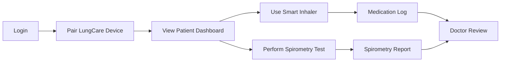

### Doctor Workflow

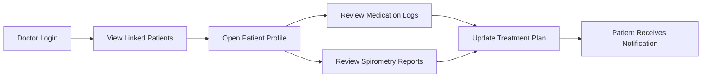

---

## 🖼️ Screenshots

### Mobile Application Screens

<table>
  <tr>
    <td align="center"> <b>Login Screen</b></td>
    <td align="center">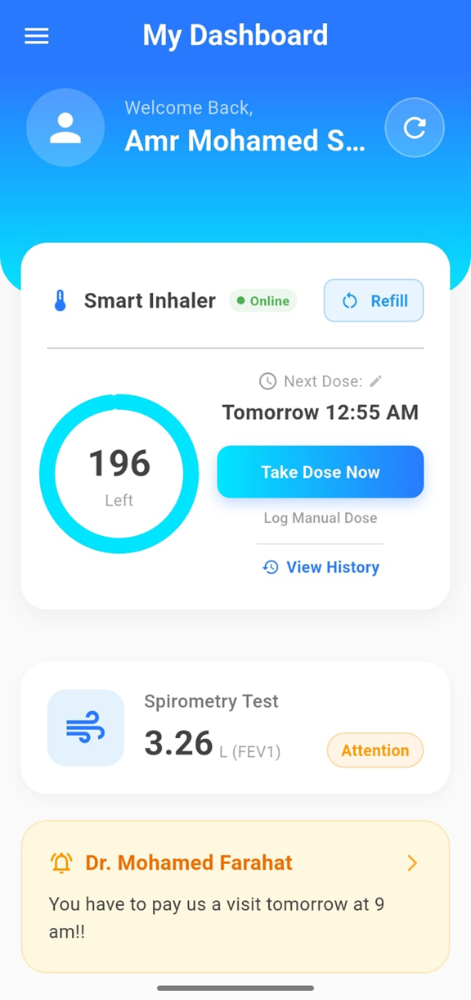 <b>Patient Dashboard</b></td>
    <td align="center"> <b>My Device Page</b></td>
  </tr>
  <tr>
    <td align="center">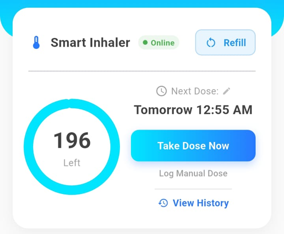 <b>Smart Inhaler</b></td>
    <td align="center"> <b>Spirometry Instructions</b></td>
    <td align="center">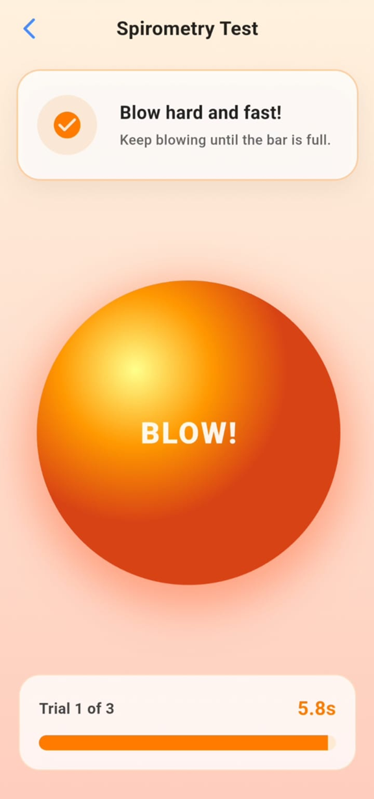 <b>Gamified Spirometry Test</b></td>
  </tr>
  <tr>
    <td align="center"> <b>Spirometry Report</b></td>
    <td align="center"> <b>Doctor Dashboard</b></td>
    <td align="center">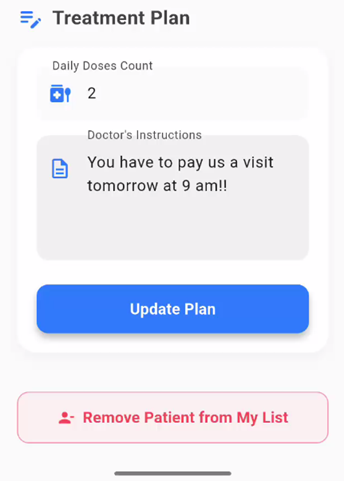 <b>Treatment Plan Update</b></td>
  </tr>
</table>

### Smart Device and System Design

<table>
  <tr>
    <td align="center"> <b>LungCare Smart Device</b></td>
    <td align="center"> <b>Product Architecture</b></td>
  </tr>
  <tr>
    <td align="center"> <b>Product Design Concept</b></td>
    <td align="center"> <b>3D-Printed Housing</b></td>
  </tr>
</table>

---

## 🛠️ Technology Stack

### Mobile Application

- Flutter
- Dart
- Firebase Authentication
- Cloud Firestore
- Firebase Realtime Database
- Local Notifications
- Bluetooth Low Energy
- Data visualization and spirometry reporting

### Embedded System

- ESP32 microcontroller
- Bluetooth Low Energy communication
- Pressure-based airflow sensing
- MPU6050 orientation sensing
- Servo motor actuation
- Status indicators
- Battery-powered portable design

### Mechanical Design

- Custom 3D-printed housing
- pMDI canister holder
- Mouthpiece interface
- Integrated airflow path
- Internal electronics compartment

---

## 🔐 Security Note

This public repository does not include the application source code, Firebase configuration files, ESP32 firmware, BLE UUIDs, device control commands, API keys, or any private database structure.

The complete implementation is kept private because the project integrates with:

- Firebase services
- Bluetooth Low Energy device communication
- ESP32 firmware
- Smart inhaler actuation logic
- Spirometry signal processing
- Patient-related medical data
- Smart device control workflows

This public version is intended only to present the project idea, device concept, application features, workflow, and user interface.

---

## 🎓 Academic Information

| Field | Details |
|---|---|
| Project Name | LungCare: Smart Management System for Obstructive Lung Disease |
| Application Name | LungCare |
| University | Capital University |
| Faculty | Faculty of Engineering |
| Department | Biomedical Engineering Department |
| Graduation Year | 2026 |

---

## 👥 Team Members

- AbdulAzeem Lotfy AbdulAzeem
- Amr Mohamed Sayed
- Ehab Mokhtar Mohamed
- Mahmoud Ahmed Zaalouk
- Mohamed Farhat Hassan
- Youssef Gamal Hussien

---

## 👨‍🏫 Supervisors

- Dr. Mohamed Ali
- Dr. Yomna Hassan

---

## 🚧 Project Status

The project is currently developed as a graduation project prototype combining mobile application development, embedded systems, Bluetooth communication, Firebase cloud services, and respiratory healthcare monitoring.

---

## ⚠️ Disclaimer

LungCare is developed for academic and research purposes as a graduation project prototype.

It is not intended to replace professional medical diagnosis, clinical spirometry devices, or direct medical supervision.
