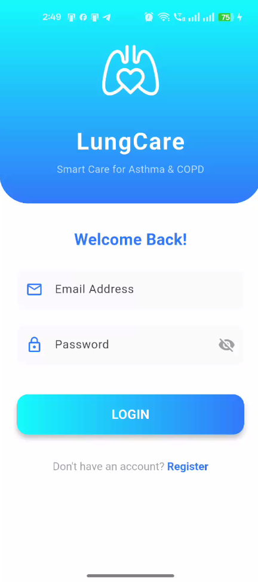
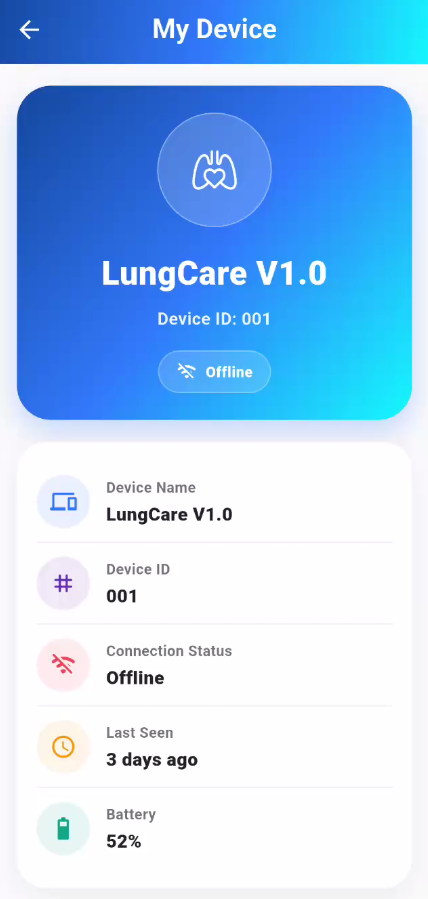
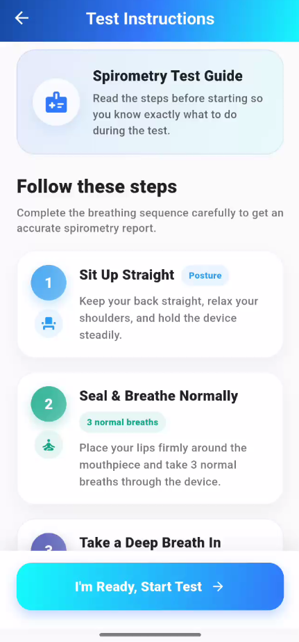
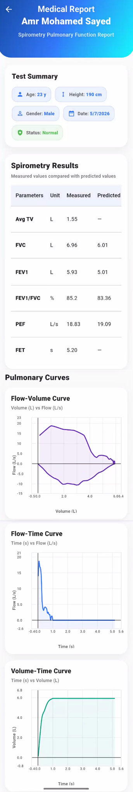
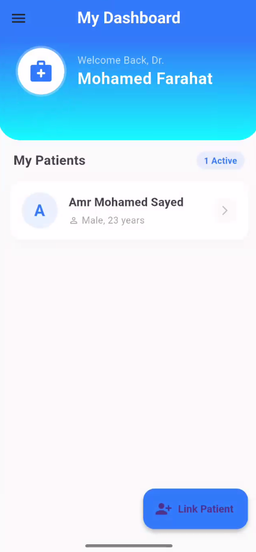
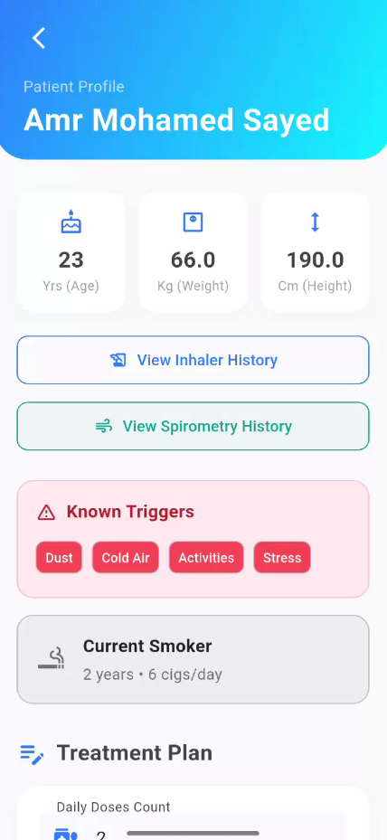

# LungCare Mobile Application

## Smart Management System for Obstructive Lung Disease

LungCare is a mobile healthcare application designed to support patients with obstructive lung diseases by connecting a smart respiratory device, patients, and doctors in one integrated digital system.

The application provides smart inhaler control, guided spirometry testing, medical report generation, treatment plan updates, device management, and patient-doctor follow-up.

> This repository is a public showcase version of the project.  
> The source code is kept private for security reasons because the system integrates with Firebase services, Bluetooth Low Energy communication, and medical-device-related workflows.

---

## Project Overview

Patients with obstructive lung diseases often need continuous medication tracking, periodic pulmonary function monitoring, and regular follow-up with healthcare providers.

LungCare was developed to make this process more connected and organized by combining:

- A Flutter mobile application
- ESP32 Bluetooth Low Energy communication
- Smart inhaler dose tracking
- Digital spirometry test guidance
- Firebase cloud-based medical data storage
- Doctor dashboard for patient follow-up

The system aims to improve treatment adherence, support remote monitoring, and provide a clearer view of the patient’s respiratory condition over time.

---

## Main Application Users

### Patient

The patient can:

- Pair and manage a LungCare device
- Take medication using the smart inhaler workflow
- Perform guided spirometry tests
- View spirometry reports
- Receive treatment plan updates
- Receive low-dose and low-battery notifications
- Monitor device status through the My Device page

### Doctor

The doctor can:

- View linked patients
- Review patient profiles
- Monitor medication logs
- Review spirometry reports
- Update treatment plans
- Send medical instructions to patients

---

## Key Features

### Smart Inhaler Workflow

The smart inhaler module allows the patient to start the dose process from the mobile application.

The app communicates with the ESP32 device through Bluetooth Low Energy. The dose is only logged after the app receives a confirmed dose signal from the device.

This helps avoid false dose logging and improves medication tracking accuracy.

---

### Guided Spirometry Test

The application provides a guided spirometry workflow to help the patient perform the test correctly.

The spirometry instructions screen includes:

- Written test steps
- Patient-friendly breathing guidance
- An instructional video guide inside the app
- Start test button leading to the interactive spirometry test screen

The test includes normal breathing followed by forced exhalation trials.

---

### Spirometry Reports

The application stores and displays important pulmonary function parameters, including:

- FVC
- FEV1
- FEV1/FVC Ratio
- PEF
- FET
- Test quality notes
- Flow-volume curve
- Flow-time curve

These reports help doctors evaluate the patient’s respiratory condition and follow disease progression.

---

### My Device Page

The My Device page allows the patient to monitor and manage the paired LungCare device.

It displays:

- Device name
- Device ID
- Connection status
- Last seen time
- Battery percentage
- Unpair device option

The page also supports secure device ownership, ensuring that one physical device can only be paired with one patient at a time.

---

### Notifications and Alerts

The application supports several patient notifications:

- Treatment plan update notification
- Inhaler low-dose notification
- Low battery notification
- Device-related reminders

These alerts help patients stay consistent with treatment and device usage.

---

### Doctor Dashboard

The doctor dashboard allows healthcare providers to follow patients remotely.

Doctors can review medication usage, spirometry reports, and update the patient treatment plan.

When the doctor updates the plan, the patient receives a notification inside the application.

---

## Application Workflow

### Patient Workflow

1. Patient logs into the application.
2. Patient pairs the LungCare device.
3. Patient views device status from the My Device page.
4. Patient takes medication using the Smart Inhaler card.
5. Patient performs a guided spirometry test.
6. Spirometry results are saved and displayed as reports.
7. Patient receives notifications for treatment updates, low dose count, and low battery.

---

### Doctor Workflow

1. Doctor logs into the application.
2. Doctor views linked patients.
3. Doctor opens a patient profile.
4. Doctor reviews medication logs.
5. Doctor reviews spirometry reports.
6. Doctor updates the treatment plan.
7. Patient receives the updated medical instructions.

---

## Technology Stack

- Flutter
- Dart
- Firebase Authentication
- Cloud Firestore
- Firebase Realtime Database
- Firebase Local Notifications
- Bluetooth Low Energy
- ESP32
- Mobile-based spirometry visualization

---

## Screenshots

### Login Screen

---

### Patient Dashboard

---

### My Device Page

---

### Smart Inhaler Card

---

### Spirometry Instructions with Video Guide

---

### Gamified Spirometry Test

---

### Spirometry Report

---

### Doctor Dashboard

---

### Doctor Patient View

---

### Treatment Plan Update

---

## Security Note

This public repository does not include the application source code, Firebase configuration files, ESP32 firmware, API keys, or any private database structure.

The complete implementation is kept private because the project integrates with:

- Firebase services
- Bluetooth Low Energy device communication
- Patient-related medical data
- Smart device control logic

This public version is intended only to present the project idea, features, workflow, and user interface.

---

## Academic Information

**Project Name:** Smart Management System for Obstructive Lung Disease  
**Application Name:** LungCare  
**University:** Capital University  
**Faculty:** Faculty of Engineering  
**Department:** Biomedical Engineering Department  
**Graduation Year:** 2026  

---

## Team Members

- AbdulAzeem Lotfy AbdulAzeem
- Amr Mohamed Sayed
- Ehab Mokhtar Mohamed
- Mahmoud Ahmed Zaalouk
- Mohamed Farhat Hassan
- Youssef Gamal Hussien

---

## Supervisors

- Dr. Mohamed Ali
- Dr. Yomna Hassan

---

## Project Status

The project is currently developed as a graduation project prototype combining mobile application development, embedded systems, Bluetooth communication, Firebase cloud services, and respiratory healthcare monitoring.

---

## Disclaimer

LungCare is developed for academic and research purposes as a graduation project prototype. It is not intended to replace professional medical diagnosis, clinical spirometry devices, or direct medical supervision.
